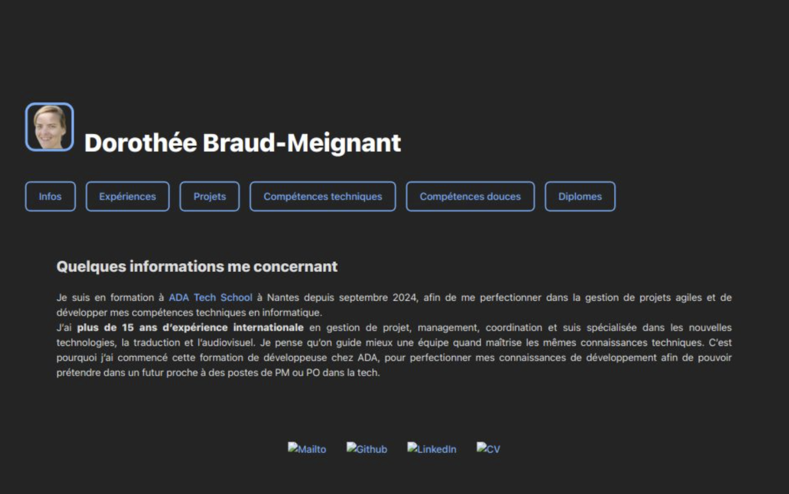

# 🌐 Mon Portfolio - Développeuse Fullstack

Bienvenue sur mon portfolio de développement web ! 
Ce site présente mon parcours, mes compétences, 
mes projets réalisés dans le cadre de ma formation 
et de mes expériences professionnelles.

---

## 🎨 **Aperçu du Projet**
🔗 **Lien vers le portfolio** : [cv-react-3tpw2uy0f-dorotheebms-projects.vercel.app]
📸 **Technologies utilisées** : React, CSS, TailwindCSS, React Router  



---

## 🚀 **Fonctionnalités principales**
- **📖 Page d'accueil** : Présentation de mon parcours et de mes objectifs.  
- **⚙️ Compétences** : Détail de mes compétences techniques et méthodologiques.  
- **💼 Expériences** : Description de mes expériences professionnelles.  
- **📌 Projets** : Liste de projets réalisés avec liens vers GitHub.  
- **🎓 Diplômes** : Mon parcours académique et certifications.  
- **📬 Contact** : Formulaire de contact pour me joindre facilement.  

---

## 🛠 **Installation et Utilisation**

### 📌 **Prérequis**
- **Node.js** (v18+ recommandé)  
- **npm** (ou **yarn**) installé  

### 📥 **Cloner le projet**
```sh
git clone https://github.com/DorotheeBM/mon-portfolio.git
cd mon-portfolio
```

### 📦 **Installer les dépendances**
```sh
npm install
```

### 🚀 **Lancer le projet en mode développement**
```sh
npm run dev
```
Puis ouvre **http://localhost:5173/** dans ton navigateur.

### 🏗 **Construire pour la production**
```sh
npm run build
```
Les fichiers seront générés dans le dossier **`dist/`**.

---

## 🏗 **Technologies utilisées**
- **React.js** - Librairie pour l'interface utilisateur  
- **React Router** - Gestion de la navigation  
- **TailwindCSS** - Styles rapides et responsifs  
- **PostCSS & Autoprefixer** - Préprocessing CSS  

---

## 📂 **Structure du projet**
```
mon-portfolio/
│── public/               # Fichiers statiques
│── src/
│   ├── components/       # Composants React
│   │   ├── Header.jsx
│   │   ├── Footer.jsx
│   │   ├── Home.jsx
│   │   ├── Competences.jsx
│   │   ├── Experiences.jsx
│   │   ├── Projets.jsx
│   │   ├── Diplomes.jsx
│   │   ├── ContactPage.jsx
│   ├── assets/           # Images et icônes
│   ├── index.css         # Styles globaux
│   ├── App.jsx           # Composant principal
│   ├── main.jsx          # Point d'entrée React
│── package.json          # Fichier de configuration npm
│── tailwind.config.js    # Configuration de Tailwind
│── vite.config.js        # Configuration de Vite
│── README.md             # Documentation du projet
```

---

## 🎓 **Mon Parcours Académique**

### RNCP VI Concepteur Développeur d’Applications - ADA Tech School (2024-2026)
- **Apprentissage par projets** : Développement d’applications web et mobiles en conditions réelles.  
- **Méthodes agiles** : Scrum/Kanban, backlog, user stories, sprints et rétrospectives.  
- **Écoconception** : Optimisation du code, accessibilité, sobriété numérique.  
- **Stack technique** : JavaScript, React, PHP, Symfony, MySQL, Git/GitHub.  
  
---

## 💼 **Mes Projets**

### 🎯 Quiz Nourriture Française
🔗 [Lien GitHub](https://github.com/adatechschool/projet-collectif-nantes-quizz-det-team.git)  
- **Développement fullstack** en React et Node.js.  
- **Gestion de backlog** et rédaction des user stories.  
- **Illustrations et traduction** pour une accessibilité internationale.  

### 📊 DAF - Intégration API FBI et Dataviz
🔗 [Lien GitHub](https://github.com/adatechschool/projet-collectif-nantes-dataviz-daf.git)  
- **Intégration API REST** du FBI pour récupérer et afficher les données.  
- **Data visualization** avec D3.js et Chart.js.  
- **Prototypage UX/UI** et conception interactive.  

### 🖥 Extension Chrome - Accessibilité Web
🔗 [Lien GitHub](https://github.com/DorotheeBM/projet-collectif-nantes-extension-navigateur-dgct.git)  
- **Développement d’une extension Chrome** (JavaScript, Manifest v3).  
- **Amélioration de la lisibilité** (typographie, couleurs, contrastes).  
- **Ajout d’un narratif vocal** pour la lecture des contenus.  

---

## 📬 **Me contacter**
🔗 **LinkedIn** : [Mon profil](https://www.linkedin.com/in/dorothee-braud/)  
🐙 **GitHub** : [Mon GitHub](https://github.com/DorotheeBM)  

---

## 🌟 **Contribuer**
Les contributions sont les bienvenues ! Si vous souhaitez proposer des améliorations, n’hésitez pas à ouvrir une **issue** ou à faire une **pull request**.

---

## 📄 **Licence**
Ce projet est sous licence MIT - vous pouvez l'utiliser librement.

---

### 🚀 **Merci de votre visite !**
N’hésitez pas à me laisser un message ou à me contacter pour toute opportunité professionnelle.  
```

